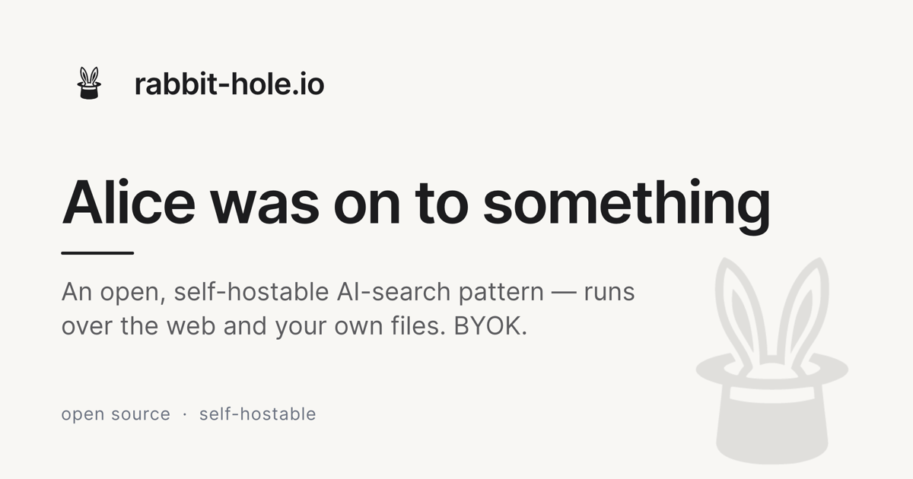

<p align="center">
  <a href="https://rabbit-hole.io">
    
  </a>
</p>

# Rabbit Hole

> AI search you can self-host. Web + Wikipedia + your files, with a clean multi-protocol API.

Apache 2.0 — run it yourself, plug in your own LLM key, no subscription.

## What you get

- Perplexity-style web search agent (bring your own LLM — our gateway, or any OpenAI-compatible/Anthropic key) with streaming answers and inline citations.
- File / audio / video / PDF ingestion via the bundled job processor — uploaded media gets transcribed, parsed, and embedded into a searchable corpus (pgvector; ingest→embed pipeline landing, see issue #291).
- **Deep research** — a multi-step pipeline (scope → research → evaluate → synthesis) that produces a cited, sourced report on a topic.
- Two distribution surfaces: the chat **Web UI** and the **`rh` CLI** (`@protolabsai/rabbit-hole-cli`: `search`, `recall`, `research`, `ingest`, `status`) for fleet agents to shell out to. An OpenAI-compatible API is also exposed.
- Optional Langfuse tracing.

> Earlier versions had a Neo4j/Qdrant knowledge-graph workspace; it was removed and neither search nor deep research depends on it.

## Quick start (self-host)

You need Docker with the Compose plugin and an LLM provider key.

```bash
git clone https://github.com/protoLabsAI/rabbit-hole.io.git
cd rabbit-hole.io
cp .env.example .env
# edit .env — set ANTHROPIC_API_KEY (or OPENAI_API_KEY)
docker compose up -d
```

Open `http://localhost:3399`.

What's running:
- `rabbit-hole` — the Next.js search app
- `job-processor` — file/audio/video ingest pipeline
- `postgres` + `postgres-jobs` — sessions and the job queue
- `minio` + `minio-init` — object storage for uploaded files

What's **not** running by default:
- A web search backend. Without `SEARXNG_ENDPOINT` set, the agent only has Wikipedia. Run [SearXNG](https://docs.searxng.org/admin/installation-docker.html) on your network and point `SEARXNG_ENDPOINT` at it.

### Minimum (ingest + CLI, no web UI)

For headless / fleet use — agents shell out to the `rh` CLI and never touch the web app — bring up just the ingest backend and install the CLI from npm:

```bash
docker compose up -d postgres postgres-jobs minio minio-init job-processor
npm i -g @protolabsai/rabbit-hole-cli
```

The CLI talks to the job-processor (default `http://localhost:8680`) and your LLM gateway; run `rh --help` for `search`, `research`, `ingest`, and `status`. This is the supported path for the fleet deployment — the `rabbit-hole` web service stays available in the full stack above for self-hosters who want the UI.

## Configuration

All env vars live in `.env`. The required ones:

```dotenv
ANTHROPIC_API_KEY=...        # one of these is required
OPENAI_API_KEY=...

POSTGRES_PASSWORD=...        # any string; defaults work for local
POSTGRES_JOB_PASSWORD=...
MINIO_ROOT_PASSWORD=...
```

Recommended additions:

```dotenv
SEARXNG_ENDPOINT=http://searxng:8080   # enables web search beyond Wikipedia
GROQ_API_KEY=...                       # free Whisper transcription for audio uploads
```

See [`.env.example`](./.env.example) for the full list.

## Local dev (without Docker)

```bash
pnpm install
pnpm run dev:rabbit-hole
```

Opens on `http://localhost:3399`. You still need a Postgres + MinIO instance reachable; the `docker-compose.yml` will give you those and you can run the Next.js app on the host.

## Roadmap

| Surface | Status |
|---|---|
| Web search UI (`/`) | shipping |
| Self-host docker-compose | shipping |
| `rh` CLI (`@protolabsai/rabbit-hole-cli`) | shipping |
| OpenAI-compatible API (`/v1/chat/completions`) | in progress |
| Corpus search (pgvector) | in progress ([#291](https://github.com/protoLabsAI/rabbit-hole.io/issues/291)) |
| Deep research (`/api/research/deep`) | shipping |

> The HTTP MCP server and standalone A2A endpoint from earlier versions are retired — fleet agents use the `rh` CLI instead.

## Teach your agent to use it (skill)

This repo ships a Claude **skill** at [`.claude/skills/rabbit-hole/`](./.claude/skills/rabbit-hole/SKILL.md) that teaches an agent how to drive `rh` — when to `search` vs `recall`, how to `ingest` and `research`, output shapes, and config. Load it into your own agent by copying the folder into your project or user skills dir:

```bash
# project-scoped (this repo already has it)
cp -r .claude/skills/rabbit-hole <your-project>/.claude/skills/

# or user-scoped, available everywhere
cp -r .claude/skills/rabbit-hole ~/.claude/skills/
```

It loads automatically when the agent needs web/corpus search, research, or document ingestion (and `rh` is on PATH).

## License

Apache 2.0 — see [LICENSE](./LICENSE).
