# React Flow Data Management - Sequence Diagram

**Research Page Data Flow Architecture**

## Overview

The research page uses a multi-layer architecture for React Flow data management:

1. **Graphology** - In-memory graph (source of truth)
2. **React Flow** - Visual rendering layer
3. **Yjs** - CRDT for persistence and collaboration
4. **Hocuspocus** - WebSocket sync to PostgreSQL
5. **IndexedDB** - Local cache for offline support

---

## Sequence Diagram

```mermaid
sequenceDiagram
    participant User
    participant ReactFlow as React Flow Canvas
    participant Graphology as Graphology Graph
    participant YjsDoc as Yjs Document
    participant Hocuspocus as Hocuspocus Provider
    participant PostgreSQL as PostgreSQL Database
    participant IndexedDB as IndexedDB Cache

    Note over User,IndexedDB: INITIAL LOAD

    User->>ReactFlow: Navigate to /research?entity=X
    ReactFlow->>Graphology: Initialize newGraph()
    Graphology->>YjsDoc: Connect to room ID
    YjsDoc->>Hocuspocus: useHocuspocusYjs(roomId)
    Hocuspocus->>IndexedDB: Load cached state
    IndexedDB-->>Hocuspocus: Return cached data (if exists)
    Hocuspocus->>PostgreSQL: Connect WebSocket + sync
    PostgreSQL-->>Hocuspocus: Send latest state
    Hocuspocus-->>YjsDoc: Merge states
    YjsDoc-->>Graphology: Trigger observer

    Note over Graphology,ReactFlow: Load from Yjs to Graph
    Graphology->>Graphology: graph.clear()
    loop For each node in Yjs data
        Graphology->>Graphology: graph.addNode(id, attrs)
    end
    loop For each edge in Yjs data
        Graphology->>Graphology: graph.addEdge(source, target, attrs)
    end

    Graphology->>ReactFlow: graphToReactFlow(graph)
    ReactFlow->>ReactFlow: Convert to {nodes, edges}
    ReactFlow->>User: Render canvas with nodes

    Note over User,IndexedDB: USER INTERACTION - NODE DRAG

    User->>ReactFlow: Drag node to new position
    ReactFlow->>ReactFlow: onNodeDragStop(event, node)
    ReactFlow->>Graphology: applyReactFlowNodeMove(graph, id, position)
    Graphology->>Graphology: graph.mergeNodeAttributes(id, {x, y})
    Graphology->>ReactFlow: handleGraphChange()
    ReactFlow->>ReactFlow: setGraphVersion(v + 1)

    Note over ReactFlow,YjsDoc: Persist to Yjs
    ReactFlow->>Graphology: Serialize graph
    loop For each node
        Graphology->>Graphology: Get node attributes
    end
    Graphology-->>ReactFlow: {nodes: [...], edges: [...]}

    ReactFlow->>YjsDoc: onDataChange(newData)
    YjsDoc->>YjsDoc: ydoc.transact(() => {...}, userId)
    YjsDoc->>YjsDoc: yWorkspace.set("canvasData", data)

    Note over YjsDoc,PostgreSQL: Automatic Sync
    YjsDoc->>Hocuspocus: Propagate change
    Hocuspocus->>PostgreSQL: WebSocket update
    PostgreSQL->>PostgreSQL: Save to database
    Hocuspocus->>IndexedDB: Cache locally
    IndexedDB->>IndexedDB: Store in y-${roomId}

    Note over YjsDoc,ReactFlow: Local Observer Update
    YjsDoc->>Graphology: Yjs observer fires
    Graphology->>Graphology: Check isSerializingRef
    Note over Graphology: Skip (own update)

    ReactFlow->>ReactFlow: graphToReactFlow(graph)
    ReactFlow->>User: Re-render with new position

    Note over User,IndexedDB: UNDO OPERATION

    User->>ReactFlow: Press Ctrl+Z
    ReactFlow->>YjsDoc: undoManager.undo()
    YjsDoc->>YjsDoc: Revert to previous state
    YjsDoc->>Hocuspocus: Propagate undo
    Hocuspocus->>PostgreSQL: Save reverted state

    YjsDoc->>Graphology: Yjs observer fires
    Graphology->>Graphology: isSerializingRef = false
    Graphology->>Graphology: graph.clear()
    loop For each node in reverted Yjs data
        Graphology->>Graphology: graph.addNode()
    end

    Graphology->>ReactFlow: setGraphVersion(v + 1)
    ReactFlow->>ReactFlow: graphToReactFlow(graph)
    ReactFlow->>User: Render previous state

    Note over User,IndexedDB: REMOTE COLLABORATION

    participant OtherUser as Other User

    OtherUser->>PostgreSQL: Make change via WebSocket
    PostgreSQL->>Hocuspocus: Broadcast update
    Hocuspocus->>YjsDoc: Receive remote change
    YjsDoc->>Graphology: Yjs observer fires

    Graphology->>Graphology: Sync from Yjs
    Graphology->>Graphology: graph.clear() + rebuild
    Graphology->>ReactFlow: Trigger re-render
    ReactFlow->>ReactFlow: graphToReactFlow(graph)
    ReactFlow->>User: Show remote changes

    Note over User,IndexedDB: EXPORT BUNDLE

    User->>ReactFlow: Right-click > Export
    ReactFlow->>Graphology: exportBundleFiltered(graph)
    loop For each visible node
        Graphology->>Graphology: Convert to Entity
    end
    loop For each edge with visible endpoints
        Graphology->>Graphology: Convert to Relationship
    end
    Graphology-->>ReactFlow: RabbitHoleBundleData
    ReactFlow->>User: Download JSON file

    Note over User,IndexedDB: IMPORT BUNDLE

    User->>ReactFlow: Upload JSON file
    ReactFlow->>ReactFlow: parseImportFile(file)
    ReactFlow->>ReactFlow: validateRabbitHoleBundle(data)
    ReactFlow->>Graphology: importBundle(graph, bundle)

    alt Replace Mode
        Graphology->>Graphology: graph.clear()
    end

    loop For each entity in bundle
        Graphology->>Graphology: upsertNode(graph, id, attrs)
    end
    loop For each relationship
        Graphology->>Graphology: upsertEdge(graph, id, src, tgt, attrs)
    end

    Graphology->>ReactFlow: handleGraphChange()
    ReactFlow->>YjsDoc: Persist to Yjs
    YjsDoc->>Hocuspocus: Sync to server
    Hocuspocus->>PostgreSQL: Save imported data
```



---

## Data Layer Responsibilities

### 1. Graphology Graph (In-Memory)

**Role:** Single source of truth for UI state

**Responsibilities:**

- Node/edge storage with full attributes
- Position tracking (x, y coordinates)
- Graph operations (add, update, delete)
- Filtering logic (hidden nodes, entity types)

**Interface:**

```typescript
interface GraphNodeAttributes {
  uid: string;
  name: string;
  type: EntityType;
  x?: number;
  y?: number;
  color: string;
  icon: string;
  properties?: Record<string, any>;
  tags?: string[];
  hidden?: boolean; // AI context entities
}

interface GraphEdgeAttributes {
  uid: string;
  type: string;
  source: string;
  target: string;
  sentiment?: string;
  confidence?: number;
}
```

### 2. React Flow (Rendering)

**Role:** Visual canvas for user interaction

**Responsibilities:**

- Render nodes and edges
- Handle drag/drop interactions
- Manage viewport (zoom, pan)
- Custom node/edge components

**Data Format:**

```typescript
// Graphology → React Flow
const { nodes, edges } = graphToReactFlow(graph, hiddenEntityTypes);

// React Flow nodes
{
  id: "person:elon_musk",
  type: "entity",
  position: { x: 250, y: 200 },
  data: { uid, name, type, properties, tags }
}

// React Flow edges
{
  id: "rel:123",
  source: "person:elon_musk",
  target: "org:tesla",
  type: "relation",
  data: { type: "CEO", sentiment, confidence }
}
```

### 3. Yjs Document (Persistence)

**Role:** CRDT for sync and collaboration

**Responsibilities:**

- Serialize graph to JSON
- Handle concurrent edits (CRDT merge)
- Emit change events to observers
- Track change origins (userId) for undo

**Structure:**

```typescript
ydoc.getMap("workspace")
  ├─ canvasData: {
  │    graphData: {
  │      nodes: [...],  // Serialized Graphology nodes
  │      edges: [...]   // Serialized Graphology edges
  │    },
  │    hiddenEntityTypes: [...],
  │    expandedNodes: [...]
  │  }
  └─ metadata: { updatedAt, owner, ... }
```

### 4. Hocuspocus Provider (Network)

**Role:** WebSocket sync to PostgreSQL

**Responsibilities:**

- Connect to Yjs server
- Authenticate with JWT token
- Sync Yjs updates bidirectionally
- Handle offline/online transitions

**Configuration:**

```typescript
const provider = new HocuspocusProvider({
  url: "ws://localhost:1234",
  name: roomId, // user:X:workspace:Y:latest
  document: ydoc,
  token: clerkToken,
});
```

### 5. PostgreSQL (Backend Storage)

**Role:** Persistent storage for workspaces

**Responsibilities:**

- Store Yjs binary updates
- Handle concurrent workspace access
- Room-based isolation
- Historical state tracking

**Schema:**

```sql
CREATE TABLE yjs_documents (
  room_id TEXT PRIMARY KEY,
  state BYTEA,
  updated_at TIMESTAMP
);
```

### 6. IndexedDB (Local Cache)

**Role:** Offline support and fast initial load

**Responsibilities:**

- Cache Yjs document locally
- Enable offline editing
- Fast startup (no network wait)
- Sync queue when offline

**Database:**

```
y-user:123:workspace:456:latest
  └─ Yjs binary state
```

---

## Critical Data Flow Patterns

### Pattern 1: User Edit → Persistence

```
User Action (drag node)
  ↓
React Flow onNodeDragStop
  ↓
Update Graphology (graph.mergeNodeAttributes)
  ↓
Increment graphVersion (trigger serialize)
  ↓
useEffect detects graphVersion change
  ↓
Serialize Graphology → {nodes, edges}
  ↓
onDataChange(serialized)
  ↓
ydoc.transact(() => yWorkspace.set("canvasData", ...))
  ↓
Yjs → Hocuspocus → PostgreSQL
  ↓
IndexedDB cache updated
```

### Pattern 2: Remote Change → UI Update

```
Remote user makes change
  ↓
PostgreSQL → Hocuspocus WebSocket
  ↓
Yjs document updates
  ↓
Yjs observer fires
  ↓
Check isSerializingRef (prevent loop)
  ↓
Deserialize Yjs data → Graphology
  ↓
graph.clear() + rebuild from Yjs
  ↓
setGraphVersion(v + 1)
  ↓
useEffect reruns graphToReactFlow
  ↓
React Flow re-renders with remote changes
```

### Pattern 3: Undo/Redo

```
User presses Ctrl+Z
  ↓
useYjsUndo.undo()
  ↓
Y.UndoManager reverts Yjs changes
  ↓
Yjs observer fires (with reverted data)
  ↓
Sync from Yjs → Graphology
  ↓
React Flow re-renders previous state
  ↓
Change syncs to PostgreSQL/IndexedDB
```

### Pattern 4: Loop Prevention

```
Local Change → Yjs
  ↓
Set isSerializingRef.current = true
  ↓
ydoc.transact(update)
  ↓
Yjs observer fires (local echo)
  ↓
Check isSerializingRef === true
  ↓
Skip sync (prevent infinite loop)
  ↓
Set isSerializingRef.current = false
```

---

## Component Communication

### GraphCanvasIntegrated

```typescript
// State management
const [graph] = useState(() => {
  const g = newGraph();
  // Load from Yjs data if exists
  if (data.graphData?.nodes) {
    data.graphData.nodes.forEach(node => {
      g.addNode(node.id, node);
    });
  }
  return g;
});

// Sync FROM Yjs (for undo/redo/remote changes)
useEffect(() => {
  if (isSerializingRef.current) {
    isSerializingRef.current = false;
    return; // Skip own updates
  }

  // Rebuild graph from Yjs data
  graph.clear();
  data.graphData.nodes.forEach(node => graph.addNode(node.id, node));
  data.graphData.edges.forEach(edge => graph.addEdge(...));

  setGraphVersion(v => v + 1);
}, [data.graphData]);

// Sync TO Yjs (when graph changes)
useEffect(() => {
  const serialized = serializeGraph(graph);

  isSerializingRef.current = true; // Prevent loop
  onDataChange(serialized); // → Yjs
}, [graphVersion]);
```

### ResearchEditor (React Flow Wrapper)

```typescript
// Convert Graphology → React Flow
useEffect(() => {
  const { nodes, edges } = graphToReactFlow(graph, hiddenEntityTypes);
  setNodes(nodes);
  setEdges(edges);
}, [graph.order, graph.size, hiddenEntityTypes]);

// Handle node drag → update Graphology
const onNodeDragStop = (event, node) => {
  applyReactFlowNodeMove(graph, node.id, node.position);
  onGraphChange(graph); // Triggers persistence
};
```

### useWorkspace Hook

```typescript
// Initialize Yjs connection
const { ydoc, ready } = useHocuspocusYjs({ roomId });

// Update canvas data (called by GraphCanvasIntegrated)
const updateCanvasData = useCallback(
  (data) => {
    ydoc.transact(() => {
      yWorkspace.set("canvasData", data);
    }, userId);
  },
  [ydoc, userId]
);

// Observe Yjs changes
useEffect(() => {
  const observer = () => {
    const ws = {
      canvasData: yWorkspace.get("canvasData"),
      // ...
    };
    setWorkspace(ws);
  };

  yWorkspace.observe(observer);
  return () => yWorkspace.unobserve(observer);
}, [yWorkspace]);
```

---

## Key Architectural Decisions

### 1. Graphology as Source of Truth

**Why:** React Flow is a view layer. Graphology provides graph algorithms, indexing, and efficient operations.

**Benefits:**

- Graph algorithms (BFS, DFS, pathfinding)
- Efficient neighbor queries
- Node/edge attribute management
- Platform-independent (can render with Cytoscape, Sigma, etc.)

### 2. Lazy Serialization

**Why:** Serialize only on change, not on every render.

**Implementation:**

```typescript
// Trigger serialization with version counter
setGraphVersion((v) => v + 1);

// Serialize in useEffect
useEffect(() => {
  const serialized = serializeGraph();
  onDataChange(serialized);
}, [graphVersion]); // Only when version changes
```

### 3. Loop Prevention with isSerializingRef

**Why:** Yjs observers fire on own changes, causing infinite loops.

**Pattern:**

```typescript
// Before sending to Yjs
isSerializingRef.current = true;
ydoc.transact(update);

// In Yjs observer
if (isSerializingRef.current) {
  isSerializingRef.current = false;
  return; // Skip
}
```

### 4. User-Origin Tracking for Undo

**Why:** Only undo own changes, not collaborators' changes.

**Implementation:**

```typescript
// Tag transactions with userId
ydoc.transact(() => {
  yWorkspace.set("canvasData", data);
}, userId);

// UndoManager filters by origin
const undoManager = new Y.UndoManager(scope, {
  trackedOrigins: new Set([userId]),
});
```

---

## Performance Optimizations

### 1. Debounced Persistence

- Changes to Graphology are immediate (fast UI)
- Yjs sync is debounced (reduce network traffic)

### 2. Partial Serialization

- Only serialize changed portions when possible
- Track dirty nodes/edges (future optimization)

### 3. IndexedDB Cache

- First render from cache (instant load)
- Sync with PostgreSQL in background
- Offline editing support

### 4. Hidden Node Filtering

- AI context entities marked as `hidden: true`
- Filtered out in `graphToReactFlow()`
- Not rendered, but available for CopilotKit

---

## Error Handling

### Yjs Connection Failures

```typescript
// Hocuspocus error handling
provider.on("connection-error", (err) => {
  setError("Failed to connect to collaboration server");
  // Continue in offline mode with IndexedDB
});
```

### Graph Serialization Failures

```typescript
try {
  const serialized = serializeGraph(graph);
  onDataChange(serialized);
} catch (error) {
  console.error("Failed to serialize graph:", error);
  // Keep working in-memory, retry on next change
}
```

### Undo Stack Overflow

```typescript
// Limit undo stack size
if (undoManager.undoStack.length > maxStackSize) {
  undoManager.undoStack.splice(0, excess);
}
```

---

## Data Consistency Guarantees

1. **Yjs CRDT** - Eventual consistency across all clients
2. **User-Origin Undo** - Only undo own changes
3. **Transaction Atomicity** - Changes grouped in `ydoc.transact()`
4. **Loop Prevention** - `isSerializingRef` flag pattern
5. **Validation** - `validateTabData()` before persisting

---

## Testing Scenarios

### Manual Test Checklist

- [ ] Load workspace → graph renders from PostgreSQL
- [ ] Drag node → position persists on refresh
- [ ] Ctrl+Z → undo works correctly
- [ ] Open 2 tabs → changes sync in real-time
- [ ] Go offline → continue editing
- [ ] Come online → changes sync to server
- [ ] Import bundle → merges correctly
- [ ] Export bundle → downloads visible entities

### Automated Tests

- `bundle-importer.test.ts` - Import logic validation
- `useYjsUndo.test.ts` - Undo/redo functionality

---

## Debugging Tools

### Inspect Yjs State (Browser Console)

```javascript
window.debugWorkspace = (ydoc) => {
  const yWorkspace = ydoc.getMap("workspace");
  console.log("Canvas Data:", yWorkspace.get("canvasData"));
  console.log("Metadata:", yWorkspace.get("metadata"));
};
```

### Inspect Graphology State

```javascript
console.log("Nodes:", graph.order);
console.log("Edges:", graph.size);
graph.forEachNode((id, attrs) => console.log(id, attrs));
```

### Monitor Sync Events

```javascript
ydoc.on("update", (update, origin) => {
  console.log("Yjs update from:", origin);
});

provider.on("sync", (isSynced) => {
  console.log("Sync status:", isSynced);
});
```

---

## Future Enhancements

1. **Partial Serialization** - Only sync changed nodes/edges
2. **Compression** - GZIP large graph data before network send
3. **Delta Updates** - Send diffs instead of full graph
4. **Optimistic UI** - Apply changes immediately, rollback on conflict
5. **Conflict Resolution UI** - Show merge conflicts visually

---

**Last Updated:** 2025-10-06  
**Status:** Production - Yjs workspace mode active
